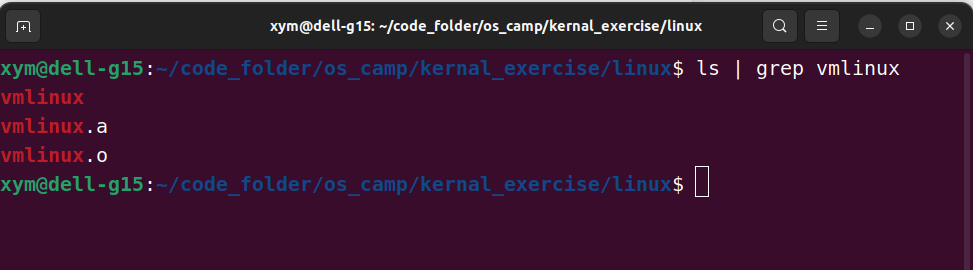
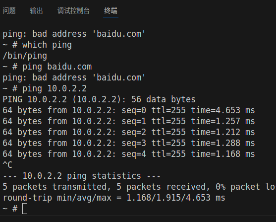
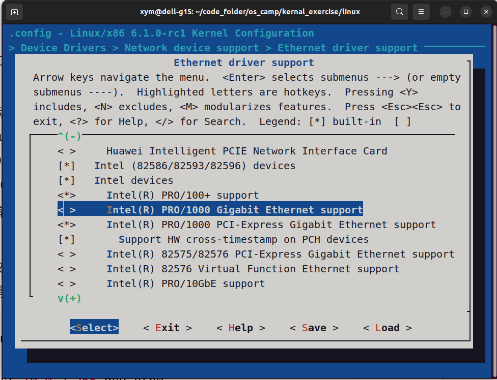
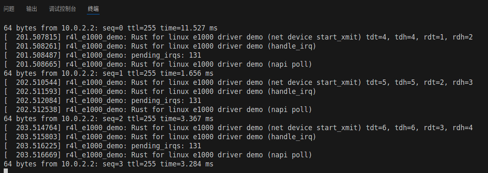
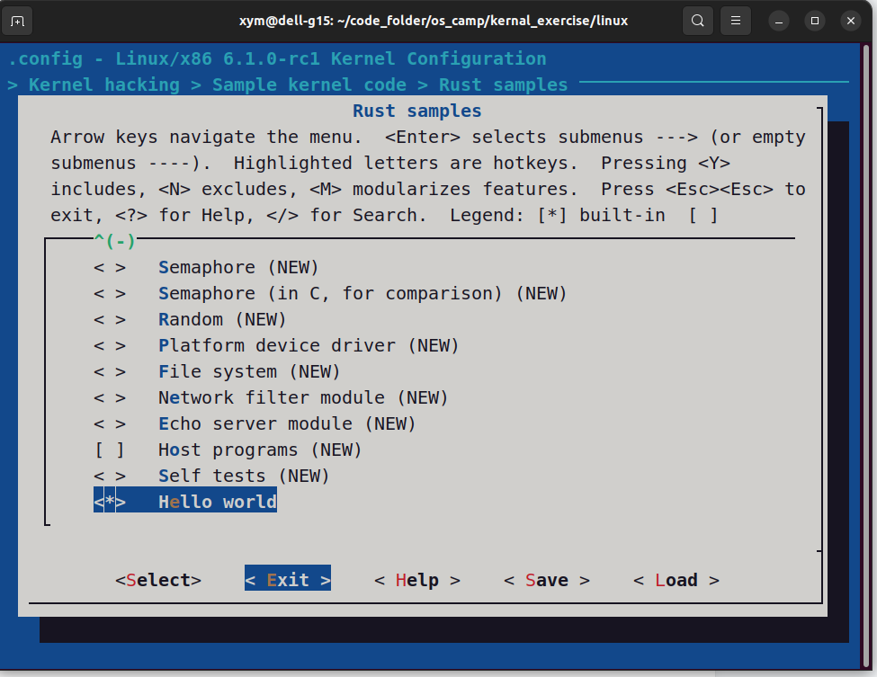
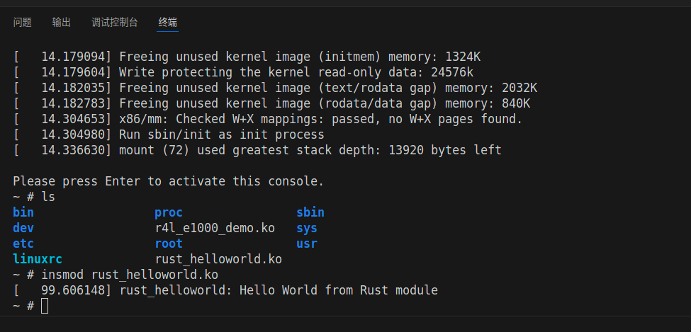

[](https://classroom.github.com/a/VsbltiDW)


# Lab1
> Do as the lab introduction-book directions requires.

i change the .gitignore to keep the vcs task as less as possible.

the finish status is by a picture.



# Lab2
> Q1:When compile it to a kernel module, where does the command lie ?

The Makefile contains the directly command which finish the compile task.
```bash
# Makefile

KDIR ?= ../linux

default:
	$(MAKE) -C $(KDIR) M=$$PWD

```

```bash
# Kbuild
obj-m := r4l_e1000_demo.o
```
using `KDIR` variable specify the kernel source code path, we call the $PWD as current working directory(OOT module directory).

We are using the kernel building system, through the command like:
```bash
make -C path/to/kernel/source
```
this will make the building system goes into the kernel source code dir and putting the configurations and compile rules in that dir into usage. the building system will find the OOT module by the -M parameter, it will try to find Makefile in that dir and compile the  module if there has one Makefile.

> Q2: How does the OOT module get related to the kernel code?


The building system will provide kernel include files and function symbols, which can been used by the OOT module.
The function defined in the kernel can be exported by something like macros.

After we run the make command above, we will get a xxx.ko(.ko stands for kernel object) file, and we could use command like
```bash
sudo insmod xxx.ko
```
to load the module into the kernel. The OOT module could get the kernel function service by using the API through the kernel Header files, for example:
```C
#include <linux/module.h>
#include <linux/kernel.h>
```

> lab steps

1. compile the module 
```bash
cd src_e1000
make LLVM=1
```

2. run qemu
```bash
./build_image.sh
# after this command, will get into a linux system.
```

3. ban the original C version Network Driver
```bash
cd ./linux
make clean
make x86_64_defconfig
make LLVM=1 menuconfig
# Selected the Rust Support
# Cancel the Inter PRO/1000 Network Driver
make LLVM=1
```

4. Insert the module
```bash
insmod r4l_e1000_demo.ko
ip link set eth0 up
ip addr add broadcast 10.0.2.255 dev eth0
ip addr add 10.0.2.15/255.255.255.0 dev eth0 
ip route add default via 10.0.2.1
ping 10.0.2.2
```





# Lab3
1. Add helloworld.rs
```rust
# ./linux/samples/rust/rust_helloworld.rs
// SPDX-License-Identifier: GPL-2.0
//! Rust minimal sample.

use kernel::prelude::*;

module! {
  type: RustHelloWorld,
  name: "rust_helloworld",
  author: "whocare",
  description: "hello world module in rust",
  license: "GPL",
}

struct RustHelloWorld {}

impl kernel::Module for RustHelloWorld {
    fn init(_name: &'static CStr, _module: &'static ThisModule) -> Result<Self> {
        pr_info!("Hello World from Rust module\n");
        Ok(RustHelloWorld {})
    }
}

```

2. Update the Makefile and Kconfig to put new file into kernel compile.

```Kconfig
config SAMPLE_RUST_HELLOWORLD
	tristate "Hello world"
  // here we can set kinds of var
  // [bool, tristate, int, string]
  // tristate will be three kinds of status:
  // y for yes, n for no, m for module which can be optional.
	help
	  This option builds the Rust hello world sample.

	  To compile this as a module, choose M here:
	  the module will be called rust_hello_world.

	  If unsure, say N.
```

and the change the Makefile to update the file.
```Makefile
// the CONFIG_SAMPLE_RUST_HELLOWORLD variable is the variable where we set 
// in the Kconfig, here we set it to tristate which can be optional selected
// in the menuconfig, if it is y(selected) then it will be compiled, or n
// (not selected) will not be compiled, if it is set to m, it will be compile 
// to a module
obj-$(CONFIG_SAMPLE_RUST_HELLOWORLD)	+= rust_helloworld.o
```
then we set the menuconfig, and recompile the kernel.
```bash
cd ./linux
make LLVM=1 menuconfig
# remember need to firstly set the option to M, then press the enter key
# and you will see the menu-options, or there will be no menu-options
# then recompile the kernel
make LLVM=1
cp samples/rust/rust_helloworld.ko ../src_e1000/rootfs/
cd ../src_e1000
./build_image.sh
insmod rust_helloworld.ko
```
plz notice that in the menuconfig, Y and the M are different




# Lab4
1. make sure the settings has been set correctly
2. edit the code in the file.
```rust

```
3. remove the module
```bash
rmmod r4l_e1000_demo.ko
```

# Lab5
1. finish the drop function 
```rust
  impl Drop for RustChrdev {
      fn drop(&mut self) {
          drop(&mut self._dev);
          pr_info!("Rust character device sample (exit)\n");
      }
  }
```

2. finisht the read and write function
```rust
  fn write(_this: &Self,_file: &file::File,_reader: &mut impl kernel::io_buffer::IoBufferReader,_offset:u64,) -> Result<usize> {
      // buffer lock
      let mut conetent = _this.inner.lock();
      // read form the buffer[offset] to the buffer[offset + len]
      // check the length of the buffer and the reader
      let len = min(conetent.len() as usize - offset, _reader.len());
      _reader.read_slice(&mut conetent[offset..offset + len])?;
      Ok(len)
  }

  fn read(_this: &Self,_file: &file::File,_writer: &mut impl kernel::io_buffer::IoBufferWriter,_offset:u64,) -> Result<usize> {
      let content = _this.inner.lock();
      // same as the above
      let len = min(content.len() - offset as usize, _writer.len());
      _writer.write_slice(&content[offset..offset + len])?;
      Ok(len)
  }
```
~[Lab5](images/0007.png)
